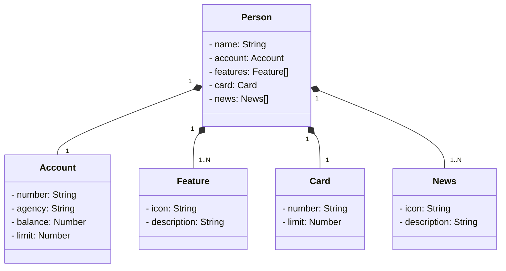

# santander-dev-week-2023

## Para acessar a API: [https://santander-dev-week-2023-production-c46e.up.railway.app/swagger-ui/](https://santander-dev-week-2023-production-c46e.up.railway.app/swagger-ui/index.html)

## diagrama de classes

conectando ao postegres usando https://railway.app/
